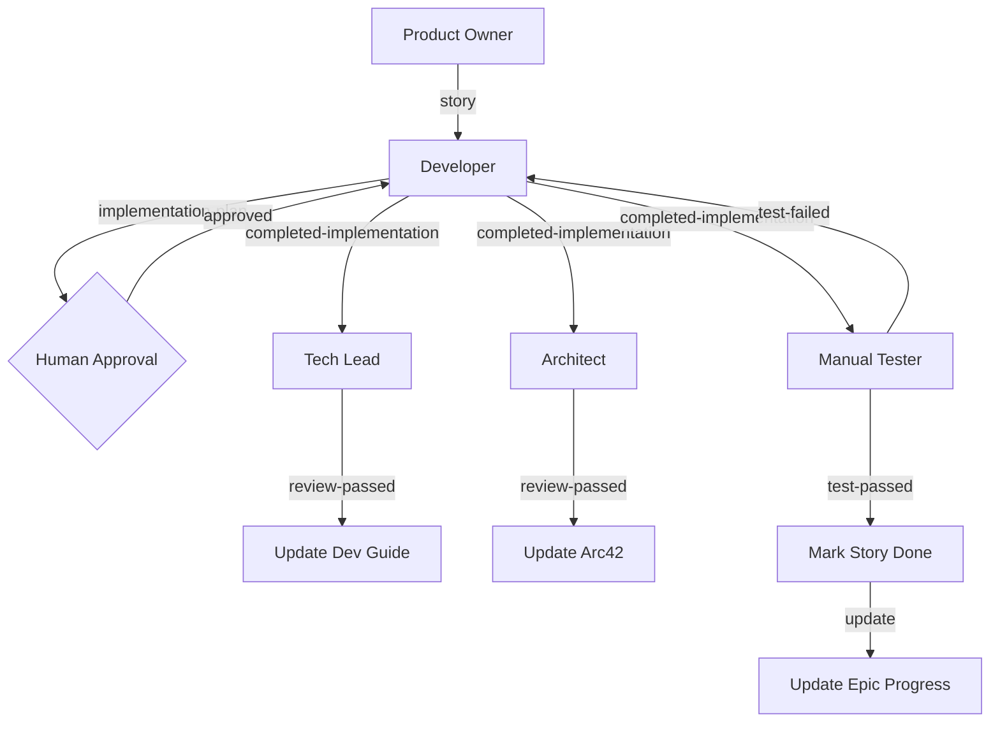

# Self-Evolving Agentic Organization System

## 🚀 Quick Navigation

### Getting Started
* **[Quick Start Guide](QUICK_START.md)** - 5-minute setup and first steps
* **[Complete System Index](INDEX.md)** - File structure and quick reference
* **[Brainstorming Session Results](BRAINSTORMING_SESSION_RESULTS.md)** - How we designed this system

### Core Documentation
* **[Organizational Principles](organizational-principles.yaml)** - System "constitution" and guidelines
* **[Project Configuration](.agentrc.yaml)** - Template for your project setup
* **[Workflow DAG](data/workflow-dag.yaml)** - Complete agent collaboration graph

### Agent Definitions
* **[Manager v1](agents/manager-v1.yaml)** - Meta-agent that creates/updates other agents
* **[Developer](agents/developer.yaml)** - Full-stack implementation specialist
* **[Tech Lead](agents/tech-lead.yaml)** - Technical review and standards
* **[Architect](agents/architect.yaml)** - Architecture review and documentation
* **[Product Owner](agents/product-owner.yaml)** - Story creation and backlog management
* **[Manual Tester](agents/manual-tester.yaml)** - QA testing and validation
* **[React UI Designer](agents/react-ui-designer.yaml)** - UI/UX design specialist

### Usage Guides
* **[Manager Commands](commands/manager.md)** - How to use the Manager agent
* **[Developer Commands](commands/developer.md)** - How to use the Developer agent

### Templates
* **[Agent Definition Template](templates/agent-definition.yaml)** - Create new agents
* **[Story Structure Template](templates/story-structure.yaml)** - Standard story format

---

## 🌟 Vision

This system represents a breakthrough in agentic development: **an AI organization that evolves itself**. Unlike traditional static agent systems, this architecture features a Manager agent that creates, updates, and optimizes other agents based on real-world project learnings.

## 🎯 Core Innovation

**Traditional Approach (including BMAD):**
- Humans manually edit agent configurations
- Static agent definitions
- Human resolves all conflicts

**Our Approach:**
- **Manager agent acts as "CTO/Head of Engineering"**
- Manager creates/updates agents using structured YAML contracts
- Manager resolves workflow conflicts in real-time
- **System improves based on project learnings**
- Human oversees Manager (CEO role)

### The Meta Pattern

> "Don't write the code, write the code generator."

The Manager agent is the **leverage point** - get it right, and it generates correctly-structured agents that solve all downstream problems.

## 🧬 Key Problems Solved

### 1. **Agent Inconsistency**
**Problem:** Using agents for similar tasks produces inconsistent results
**Solution:** YAML-based agent contracts with explicit personas, commands, and dependencies

### 2. **Context Management Chaos**
**Problem:** Context is either overwhelming or insufficient
**Solution:** Lazy-loading dependencies, project-specific config files, targeted documentation access

### 3. **Non-Deterministic Workflows**
**Problem:** Unpredictable agent behavior; changes break unexpectedly
**Solution:** DAG-based workflow definitions with explicit handoff contracts and next-agent specifications

## 🏗️ Architecture

### System Structure

```
new_team/
├── README.md                                    # This file
├── .agentrc.yaml                                # Project-specific configuration
├── organizational-principles.yaml               # System "constitution"
├── agents/                                      # Agent definitions (YAML)
│   ├── manager-v1.yaml                          # Meta-agent (creates other agents)
│   ├── product-owner.yaml
│   ├── developer.yaml
│   ├── tech-lead.yaml
│   ├── architect.yaml
│   ├── manual-tester.yaml
│   └── react-ui-designer.yaml
├── commands/                                    # Agent invocation commands
│   ├── manager.md
│   ├── product-owner.md
│   ├── developer.md
│   ├── tech-lead.md
│   ├── architect.md
│   ├── manual-tester.md
│   └── react-ui-designer.md
├── templates/                                   # Handoff contract templates
│   ├── story-structure.yaml
│   ├── implementation-plan.yaml
│   ├── technical-review.yaml
│   ├── architecture-review.yaml
│   ├── test-results.yaml
│   └── agent-definition.yaml
├── tasks/                                       # Workflow task definitions
│   ├── implement-story.yaml
│   ├── review-code.yaml
│   ├── update-architecture.yaml
│   └── test-feature.yaml
└── data/                                        # Shared knowledge base
    ├── workflow-dag.yaml                        # System workflow graph
    └── best-practices.md                        # Agent creation guidelines
```

### Workflow DAG (Directed Acyclic Graph)

The system uses a **declarative workflow graph** where agents specify:
- Which agents they can hand off to
- What data flows between them
- When loops occur (e.g., tester → developer → tester)
- What triggers each handoff



## 🎓 Key Concepts

### 1. User-Level Agents

Agents are **generic and reusable** across projects (like npm packages), not project-specific.

**Project-specific configuration** lives in `.agentrc.yaml`:

```yaml
project:
  name: transgate-claude-team
  type: web-application
  
documentation:
  architecture: docs/arc42/
  developer-guide: docs/developer-guide/
  stories: docs/product/
  
agent-overrides:
  developer:
    extra-dependencies:
      - docs/api-conventions.md
```

### 2. YAML Agent Contracts

Each agent is defined by a YAML contract:

```yaml
agent:
  name: Alex
  id: tech-lead
  title: Technical Lead
  icon: 👨‍💻
  
persona:
  role: Technical Excellence Guardian
  focus: Code quality, standards compliance
  principles:
    - Consistent code style
    - Pragmatic over perfect
    
commands:
  - review-implementation
  - update-developer-guide
  
dependencies:
  documentation:
    - {project}/developer-guide.md
  templates:
    - templates/technical-review.yaml
    
handoff-contracts:
  input:
    - story-file: Updated with implementation
  output:
    - review-results: Pass/fail + issues
  next-agents:
    - architect: {input: story-file, trigger: auto}
    - developer: {input: review-results, trigger: if-failed}
```

### 3. Manager's Bootstrap Pattern

Manager creates Manager v2, creating a self-improvement loop:

1. We create `manager-v1.yaml` manually (founding document)
2. Manager v1 creates all other agents
3. Manager v1 learns from workflows
4. **Manager v1 creates `manager-v2.yaml`** with improvements
5. You review the diff
6. Approve → Manager v2 takes over
7. Git history shows evolution

### 4. Immutable Core Principles

Even when Manager updates itself, certain principles are **protected**:

- Agents must have explicit personas
- Handoff contracts must be bidirectional
- All agent modifications require human approval
- Separation of concerns over feature completeness
- Git is the source of truth

## 🧪 Testing Strategy

### Level 1: Contract Validation (Automated)
Manager auto-generates tests that validate handoff contracts match between agents.

### Level 2: Workflow Simulation (Automated)
Simulate complete workflows with mock data to verify the DAG works correctly.

### Level 3: Regression Testing (Semi-Automated)
When Manager updates an agent:
1. Capture previous outputs from git history
2. Re-run with new agent
3. Compare outputs (semantic similarity)
4. Flag deviations for review

### Level 4: Shadow Mode (Manual)
Run both old and new agent versions in parallel, compare results, choose winner.

## 🔥 The Complete Development Workflow

### Phase 1: Story Creation
**Product Owner** defines story with acceptance criteria
- Output: `docs/product/EPIC-X/STORY-X.md`
- Next: Developer

### Phase 2: Implementation Planning
**Developer** analyzes story and creates implementation plan
- Appends plan to story file
- Waits for human approval/refinement
- Next: Implementation (same agent)

### Phase 3: Development
**Developer** implements fully autonomous:
- Writes code following developer-guide
- Writes tests
- Runs tests and builds
- Iterates until acceptance criteria met
- Output: Completed implementation + test results in story file
- Next: Tech Lead, Architect, Manual Tester (parallel)

### Phase 4: Parallel Review
**Tech Lead** reviews against developer-guide
- Output: Technical review results
- Next: Update developer-guide (if needed)

**Architect** reviews architectural consistency
- Output: Architecture review results
- Next: Update arc42 docs (if needed)

**Manual Tester** tests feature with browser automation
- Output: Test results
- Next: Developer (if failed) OR Mark done (if passed)

### Phase 5: Human Validation
Human tests feature and reviews code
- Provides feedback
- Next: Developer (if changes needed) OR Documentation

### Phase 6: Documentation Updates
**Tech Lead** updates developer-guide based on new patterns
**Architect** updates arc42 with new feature
- Next: Mark story done

### Phase 7: Progress Tracking
Story marked as done
- Updates epic progress
- Updates project progress
- Workflow complete ✅

### Meta-Workflow: Continuous Improvement
**Manager** can be invoked at any time to:
- Resolve conflicts between agents
- Update agent behaviors
- Create new agents
- Optimize workflow

## 🎯 Integration Strategy from BMAD

What we adopted from BMAD:
- ✅ YAML-based agent definitions
- ✅ Personas with explicit principles
- ✅ Command-to-task mapping
- ✅ Dependency management
- ✅ Template-based outputs
- ✅ Lazy loading of context

What we improved beyond BMAD:
- 🚀 Agent collaboration via DAG workflows
- 🚀 Self-evolving Manager agent
- 🚀 User-level (not project-level) agents
- 🚀 Real-time conflict resolution
- 🚀 Automated handoff contracts

## 📋 Getting Started

### 1. Review the Organizational Principles
Read `organizational-principles.yaml` - this is the system's "constitution"

### 2. Configure Your Project
Edit `.agentrc.yaml` to point to your project's documentation paths

### 3. Activate Manager
Use the command: `/manager` or invoke via your IDE's agent system
Ask Manager to:
- Analyze current workflow
- Create new agents
- Resolve conflicts
- Optimize team structure

### 4. Start with One Story
Test the workflow with a single story:
1. Product Owner creates story
2. Developer implements with planning phase
3. Parallel reviews
4. Iterate until done

### 5. Invoke Manager for Issues
Whenever you see:
- Conflicting agent feedback
- Unclear responsibilities
- Workflow bottlenecks

Call Manager to resolve in real-time.

## 🔮 Future Evolution

The system is designed to evolve. Expected improvements:
- Manager learns optimal agent configurations from project history
- Automatic workflow optimization based on bottleneck detection
- Agent specialization based on project type
- Multi-project learning and pattern sharing

## 🎓 Philosophical Foundation

This system treats agents as **organizational entities** not just tools:
- They have roles and responsibilities
- They collaborate through contracts
- They hand off work explicitly
- They evolve based on learnings
- They are managed by a meta-agent

**The result:** A deterministic, traceable, evolvable development organization that gets better with every project.

---

*Created through brainstorming session: October 5, 2025*
*Facilitator: Mary (Business Analyst, BMAD Method)*
*Powered by Claude Sonnet 4.5*

