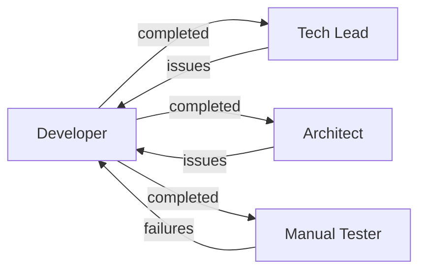

# /developer Command

Activates the Developer agent - your full-stack implementation specialist.

## Usage

```
/developer
```

## When to Use

- Need to implement a specific user story or feature
- Story has clear acceptance criteria and is ready for development
- Require code implementation following project standards
- Feature needs testing and iteration until production-ready

## What This Agent Does

The Developer agent (Dev) transforms user stories into working, tested, production-ready code through:

- **Planning Phase**: Analyzes story and creates detailed implementation plan
- **Development Phase**: Implements features following established patterns
- **QA Phase**: Writes and runs comprehensive tests
- **Iteration Phase**: Refines until all acceptance criteria met

## Activation

When you invoke `/developer`, you'll be working with Dev. The agent will:

1. Load your project's developer guide
2. Load architecture documentation
3. Ask which story to implement
4. Begin planning or continue from an existing plan

## Available Commands

- `*implement-story` - Complete story implementation workflow
- `*create-implementation-plan` - Analyze story and create detailed plan
- `*fix-issues` - Fix issues from review or testing
- `*run-tests` - Execute all tests for implementation
- `*update-implementation-plan` - Update plan based on changes

## Development Workflow

### 1. Planning Phase

```
You: /developer
Dev: Which story would you like me to implement?
You: TRAN-001-05
Dev: Let me analyze the story and create an implementation plan...

     [Creates detailed plan with]:
     - Task breakdown
     - Technology choices
     - Architectural decisions
     - Estimated effort
     
     [Appends plan to story file]
     
     Please review the plan. Should I proceed? (yes/refine/no)
```

### 2. Development Phase

```
You: yes
Dev: Starting implementation...
     
     [Implements following]:
     - Project coding standards
     - Established patterns
     - Technology stack
     - Comprehensive error handling
     
     [Updates plan if scope changes]
```

### 3. QA Phase

```
Dev: Implementation complete. Running tests...
     
     [Writes and runs]:
     - Unit tests for all functions
     - E2E tests for user interactions
     - Accessibility checks
     - Cross-browser testing
     
     Results: All tests passing ✅
```

### 4. Handoff to Reviews

```
Dev: Feature is production-ready!
     
     [Triggers parallel reviews]:
     - Tech Lead: Technical review
     - Architect: Architecture review
     - Manual Tester: Feature testing
     
     Story file updated with implementation notes.
```

### 5. Iteration if Needed

```
[If reviews find issues]
Dev: Received feedback from Tech Lead and Architect.
     Addressing 3 issues:
     1. [Issue and fix approach]
     2. [Issue and fix approach]
     3. [Issue and fix approach]
     
     [Fixes and retests]
```

## Scope Management

Developer strictly adheres to story boundaries:

✅ **Will Do:**
- Implement features defined in the story
- Write tests for implemented features
- Follow acceptance criteria exactly
- Document implementation in story file
- Suggest developer-guide improvements

❌ **Won't Do:**
- Implement features from other stories (no scope creep)
- Make architectural changes not in the story
- Skip testing to "go faster"
- Modify unrelated code without justification

## Quality Standards

### Code Quality
- Follows project coding standards
- Clean, readable, maintainable
- Proper error handling
- Edge cases covered
- Inline comments for complex logic

### Testing Requirements
- Unit tests for all new functions/components
- E2E tests for user-facing features
- All tests passing before marking complete
- Test coverage meets project standards

### Documentation
- Update relevant docs related to story
- Component documentation updated
- API changes documented
- Implementation notes in story file

## Completion Criteria

Before marking a story complete:

- ✅ All acceptance criteria met
- ✅ All tests passing
- ✅ Code follows project standards
- ✅ Implementation documented in story file
- ✅ No linter errors
- ✅ Ready for review

## Workflow Integration

Developer hands off to (parallel):



## Example: Full Story Implementation

```
You: /developer
Dev: Ready to implement! Which story?

You: TRAN-002-03 - User Authentication

Dev: Reading story... analyzing requirements...
     
     This story requires:
     - JWT token implementation
     - Login/logout endpoints
     - Session management
     - Password hashing
     
     Creating implementation plan...
     
     ## Implementation Plan
     
     ### Tasks
     1. Set up JWT library (jsonwebtoken)
     2. Create auth middleware
     3. Implement login endpoint
     4. Implement logout endpoint
     5. Add session management
     6. Write unit tests
     7. Write E2E tests
     
     ### Architectural Decisions
     - Using httpOnly cookies for tokens
     - bcrypt for password hashing
     - 7-day token expiration
     
     ### Estimated Effort: 5 story points (2 days)
     
     Approve to proceed?

You: yes

Dev: Implementing...
     [Works through each task systematically]
     ...
     Implementation complete!
     Tests passing: 24/24 ✅
     
     Story updated and ready for review.
     
     Tech Lead, Architect, and Manual Tester have been notified.
```

## Tips for Working with Developer

- **Be specific about stories**: Use story IDs (e.g., TRAN-001-05)
- **Review plans before approval**: Catch issues early
- **Trust the process**: Developer follows established patterns
- **Let it iterate**: Developer continues until criteria met
- **Check story file**: All updates are documented there

## Integration with Project

Developer reads from:
- `docs/developer-guide/` - Coding standards and patterns
- `docs/arc42/` - Architecture decisions
- `docs/product/` - Story files
- `CLAUDE.md` - Project-specific guidelines

Developer writes to:
- `src/` - Source code
- `tests/` - Test files
- Story files - Implementation notes and status

---

*Part of the Self-Evolving Agentic Organization System*

