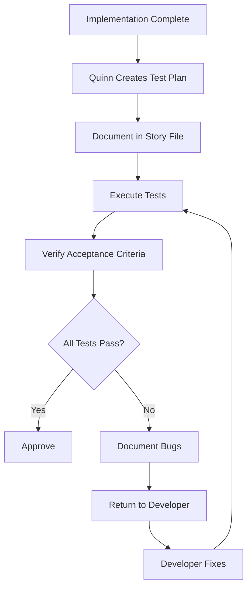

# /manual-tester Command

Activates Quinn, the Manual Tester agent - your expert QA tester who validates implementations through comprehensive manual testing.

## 🎯 CRITICAL: Subagent Invocation

**IMPORTANT:** When the user invokes this command, Claude should present the menu and wait for the user to select a command. Once the user selects a command, Claude MUST use the Task tool to launch the manual-tester subagent with the specific task.

**CRITICAL INVOCATION PATTERN:**
```
Task(subagent_type: "manual-tester", prompt: "User selected [command name/number]. User wants to: [specific details provided by user]")
```

## When to Use

Use this command when you need to:
- Test an implemented user story or feature
- Create a detailed testing plan for a story
- Execute tests and document results
- Report bugs found during testing
- Validate acceptance criteria are met

## What Happens When You Use This Command

### Activation Behavior

When you invoke `/manual-tester`, you will see:

```
🧪 Quinn, Manual QA Tester activated!

Available commands:
1. test-story - Complete testing workflow for a story
2. create-test-plan - Create detailed testing plan
3. execute-tests - Execute testing plan
4. report-bugs - Document found issues

Which command would you like to use? (enter number or name)
```

### Interaction Flow

1. **Quinn greets you** with available commands
2. **You select a command** and provide story ID
3. **Quinn creates test plan** based on acceptance criteria
4. **Quinn executes tests** systematically
5. **Quinn verifies** every acceptance criterion
6. **Quinn reports** bugs found OR approves if all pass
7. **Story continues** or returns to Developer for fixes

## Available Commands

### test-story
Complete testing workflow from planning through reporting.

**You provide:**
- Story ID to test

**Quinn delivers:**
- Detailed test plan
- Executed tests with results
- Verified acceptance criteria
- Bug reports (if issues found) OR approval (if passed)
- Updated story file with test results

### create-test-plan
Create detailed testing plan without executing yet.

**You provide:**
- Story ID

**Quinn delivers:**
- Test plan covering all acceptance criteria
- Happy path test cases
- Error scenario test cases
- Edge case test cases
- Plan documented in story file

### execute-tests
Execute an existing test plan.

**You provide:**
- Story ID (with test plan already created)

**Quinn delivers:**
- Executed tests
- Pass/fail status for each test
- Detailed failure information
- Results documented in story file

### report-bugs
Document found issues with reproduction steps.

**You provide:**
- Story ID
- Bug descriptions

**Quinn delivers:**
- Detailed bug reports
- Reproduction steps for each bug
- Expected vs actual behavior
- Severity ratings
- Bugs documented in story file

## Example Usage

### Example: Testing a Story

```
You: /manual-tester

Quinn: 🧪 Quinn, Manual QA Tester activated!
       [Shows menu]

You: test-story USER-AUTH-02

Quinn: Loading story USER-AUTH-02: User Login
       
       Creating test plan based on acceptance criteria...
       
       ## Test Plan
       
       **Story:** USER-AUTH-02 - User Login
       **Acceptance Criteria:** 4 criteria to verify
       
       ### Test Cases:
       
       **TC-01: Successful Login (Happy Path)**
       - Preconditions: Valid user account exists
       - Steps:
         1. Navigate to login page
         2. Enter valid email
         3. Enter valid password
         4. Click "Log In" button
       - Expected: User logged in, redirected to dashboard
       - Verifies: AC-1
       
       **TC-02: Invalid Credentials**
       - Steps:
         1. Navigate to login page
         2. Enter invalid email/password
         3. Click "Log In"
       - Expected: Error message shown, user not logged in
       - Verifies: AC-2
       
       **TC-03: Empty Fields**
       - Steps:
         1. Navigate to login page
         2. Leave fields empty
         3. Click "Log In"
       - Expected: Validation errors shown
       - Verifies: AC-2
       
       **TC-04: Session Persistence**
       - Steps:
         1. Log in successfully
         2. Refresh page
       - Expected: User still logged in
       - Verifies: AC-3
       
       **TC-05: Password Visibility Toggle**
       - Steps:
         1. Enter password
         2. Click visibility toggle
       - Expected: Password shown/hidden
       - Verifies: AC-4
       
       Test plan documented in story file.
       
       Executing tests...
       
       ✅ TC-01: PASSED
       ✅ TC-02: PASSED  
       ✅ TC-03: PASSED
       ❌ TC-04: FAILED
       ✅ TC-05: PASSED
       
       ## Bug Found
       
       **BUG-USER-AUTH-02-01**
       **Severity:** Major
       
       **Description:**
       User session not persisted after page refresh
       
       **Steps to Reproduce:**
       1. Navigate to http://localhost:3000/login
       2. Enter email: test@example.com
       3. Enter password: ValidPass123!
       4. Click "Log In" button
       5. Verify logged in (dashboard shows)
       6. Press F5 to refresh page
       
       **Expected Behavior:**
       User should remain logged in after refresh, dashboard still visible
       
       **Actual Behavior:**
       User redirected back to login page, session lost
       
       **Acceptance Criterion Affected:**
       AC-3: User session persisted across page refreshes
       
       **Environment:**
       - Browser: Chrome 120.0
       - OS: macOS 14.2
       - URL: http://localhost:3000
       
       ---
       
       **Test Result:** FAILED
       **Pass Rate:** 4/5 (80%)
       **Bugs Found:** 1 major
       
       Returning to Developer for fixes.
       Bug report documented in story file.
```

## Workflow Overview

How Manual Tester operates:



## Integration with Workflow

Manual Tester reviews happen in parallel with Tech Lead and Architect:

- **Receives from:** Developer (completed implementation)
- **Focuses on:** User experience, acceptance criteria, functionality
- **Returns to:** Developer (if bugs found)
- **Continues workflow:** When all tests pass

**IMPORTANT:** Manual Tester validates actual user experience through hands-on testing, complementing automated tests.

## Testing Coverage

Quinn tests:

✅ **Happy Paths** - Normal user workflows
✅ **Error Scenarios** - Error handling and edge cases
✅ **Acceptance Criteria** - Every criterion verified
✅ **User Experience** - Actual usability validation
✅ **Cross-browser** - Multiple browsers if needed
✅ **Responsive Design** - Different viewport sizes
✅ **Accessibility** - Basic accessibility checks

## Tips

- **Invoke after implementation** when developer marks story ready
- **Review test plans** before execution to ensure coverage
- **Be specific in bug reports** - reproduction steps are critical
- **Test error scenarios** - they're as important as happy paths
- **Think like a user** - not just technical validation
- **Test on actual environments** - not just in theory

---

*Part of the Self-Evolving Agentic Organization System*

