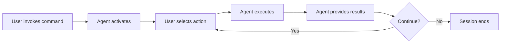

# /command-name Command

Brief description of the command's purpose and when to use it.

## 🎯 CRITICAL: Subagent Invocation

**IMPORTANT:** This command file is documentation ONLY. When the user invokes this command, Claude MUST use the Task tool to launch the actual subagent. DO NOT roleplay as the agent - actually invoke it.

**CRITICAL INVOCATION PATTERN:**
```
Task(subagent_type: "agent-id", prompt: "User invoked /command-name. User wants to: [specific request or command]")
```

## When to Use

Use this command when you need to:
- Specific use case 1
- Specific use case 2
- Specific use case 3

## What Happens When You Use This Command

### Activation Behavior

When you invoke `/command-name`, you will see:

```
🎯 [Agent Name], [Agent Title] activated!

Available commands:
1. command-one - Brief description
2. command-two - Brief description
3. command-three - Brief description

Which command would you like to use? (enter number or name)
```

### Interaction Flow

1. **Agent greets you** with name and available commands
2. **You select a command** by number or name
3. **Agent executes** the selected command workflow
4. **Agent asks** if you want to do anything else
5. **Session ends** or continues based on your choice

## Available Commands

### command-one
Brief description of what this command does.

**Usage:** Provide [specific parameters]

### command-two
Brief description of what this command does.

**Parameters:**
- `param1` - Description
- `param2` - Description

### command-three
Brief description of what this command does.

## Example Usage

### Example 1: Basic Usage

```
You: /command-name

Agent: 🎯 [Agent Name] activated!
       [Shows menu]

You: 1

Agent: [Executes command-one]
       [Shows results]
       
       Would you like to do anything else? (yes/no)

You: no

Agent: Session complete. Ready when you need me!
```

### Example 2: Direct Request

```
You: /command-name do-something-specific

Agent: I see you want to do-something-specific. Let me help you with that.
       [Executes workflow]
```

## Workflow Overview

High-level overview of what happens during command execution:



## Integration with Other Agents

How this agent hands off to other agents:

- **Triggers [agent-name]** when [condition]
- **Receives from [agent-name]** when [condition]

## Tips

- Tip 1 for effective usage
- Tip 2 for effective usage
- Tip 3 for effective usage

---

*Part of the Self-Evolving Agentic Organization System*